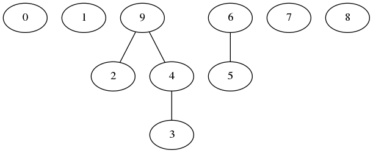

# Code Self Study Wiki

This repo contains the [programming wiki](https://wiki.codeselfstudy.com/) for Code Self Study. For the main Code Self Study website, see [this repo](https://github.com/codeselfstudy/codeselfstudy).

[](https://travis-ci.org/codeselfstudy/codeselfstudy_wiki)

## Contributing

To contribute, make a pull request. Ask an organizer at a meetup if you would like assistance.

## Development

**Tip:** pushing or merging to `master` will trigger deployment on Netlify.

Install [mdbook](https://github.com/rust-lang/mdBook) on your computer and run this command to serve it on port 3000:

```text
$ mdbook serve
```

Then visit localhost:3000.

To add new pages, edit the `src/SUMMARY.md` file. Adding new items there will automatically create new pages.

Images can go in the `src/images` directory. Here's an example of how to load an image:



## License

Except where otherwise specified, the content in the `src` directory is licensed under an [Attribution-ShareAlike 3.0 Unported (CC BY-SA 3.0)](https://creativecommons.org/licenses/by-sa/3.0/)  license, which is the same license that Wikipedia uses.

Please only submit content that you have created yourself. By submitting content to this repo, you agree to license the content under that license. Like any wiki, your content will probably be edited by other users.
