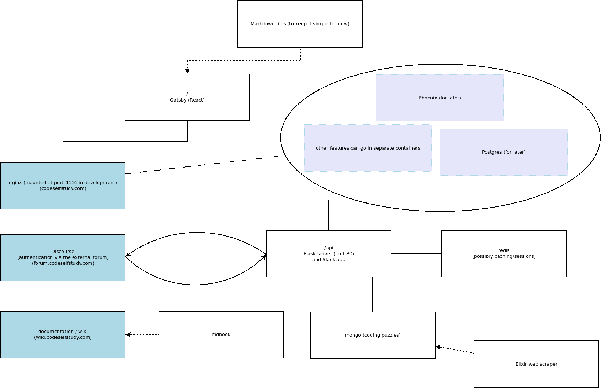

# Technology Overview

This page contains an overview the technologies used on [the main website](https://codeselfstudy.com/).

## Docker

Active:

- **Nginx** -- requests get passed through an nginx container
- **Gatsby** -- server-rendered React with content loaded from a headless CMS
- **Express API** -- this authenticates with Discourse (forum) and serves coding puzzles
- **Redis** -- session store for the Express API
- **Mongo** -- data storage for coding puzzles

TODO:

- **Phoenix/Postgres** -- coming later once the site is ready for real-time features and the data gets more complex
- **Rust/Wasm** -- visualization of algorithms & data structures with WebAssembly.

Check out the `containers` directory. Each directory there is a separate Docker container.

For an introduction to Docker, see our [Docker guide](/guides/docker.md).

Here's a diagram. See the other pages in this section for details.



## Nginx

The entry point is an nginx Docker container. It proxies all the requests to other containers.

Nginx internally serves on port 80, but port 80 is mapped to the host's machine (your laptop's) port 4444. To visit the site in development, visit [localhost:4444](http://localhost:4444/).

See the `containers/nginx/default*.conf` files for details on how the requests are sent to the other containers.

```conf
# Defining the upstream applications. Gatsby, for example, is running on port 8000 in development.
upstream gatsby {
    server gatsby:8000;
}

# Express is running on port 5000
upstream express_api {
    server express_api:5000;
}

# Nginx listens on port 80 and proxies requests to the upstream servers.
server {
    listen 80;

    location /api {
        # Express doesn't know about the `/api` prefix, so this rewrites
        # the requests for Express.
        rewrite /api/(.*) /$1 break;
        proxy_pass http://express_api;
    }

    # Routes not matched above will go to Gatsby.
    location / {
        proxy_pass http://gatsby;
    }
}
```

## Gatsby

Gatsby serves the main pages of the site. If we need SPA functionality, Gatsby can do [client-side routing](https://www.gatsbyjs.org/docs/client-only-routes-and-user-authentication/).


## Express API

Express.js is mounted at `/api` and will serve the coding puzzles as well as handle authentication via the forum.

## Mongo

This will hold the coding puzzle database for now. (MERN stack experiment)

## Redis

This container holds Express.js sessions.

## Wiki

This wiki is in a separate repo and auto-deploys on Netlify.

https://github.com/codeselfstudy/codeselfstudy_wiki

https://wiki.codeselfstudy.com/

These resources were useful in setting up the CI pipline:

- https://docs.travis-ci.com/user/deployment-v2/providers/netlify/
- https://docs.travis-ci.com/user/tutorial/
- https://github.com/travis-ci/travis.rb

Basically, Travis CI builds and deploys the site. A deploy key is encrypted and added with the Travis CI command-line interface (linked to above). The command `travis login` will connect the CLI to Travis, and then this command will add the encrypted Netlify token to the `.travis.yml` file.

```text
$ travis encrypt --add deploy.auth <auth>
```

(Netlify doesn't have to be connected to Github.)

## Phoenix

Phoenix/Postgres is coming later for real-time features and LiveView experiments (write frontend features with backend Elixir code).

## WebAssembly / Rust

TODO: visualization of algorithms & data structures in WebAssembly (Rust).

I'm picturing something along the general lines of [this](https://www.cs.usfca.edu/~galles/visualization/Dijkstra.html) but in WebAsseembly. (That code is [here](https://www.cs.usfca.edu/~galles/visualization/source.html).)
