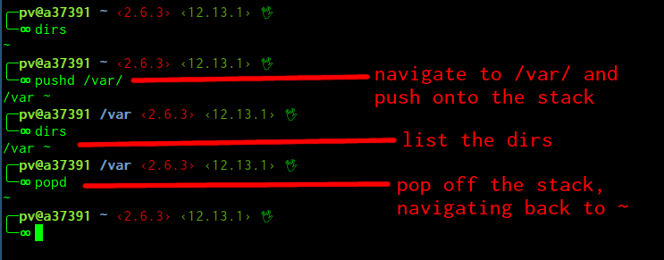

# dirs (and pushd/popd)

The `dirs` command lists a [stack](../algorithms/stack.md) of recently visited directories. You can push into the history with the `pushd` command, and pop off the stack (going back one location) with the `popd` command.

Compare `dirs` with the [`cd`](./cd.md) command. The `cd` command will change directory, but it won't remember your navigation history. You can use `pushd` like a version of the `cd` command that saves a history of where you've been.

## Options

Some common flags for `dirs` are:

- `-c` -- clear the stack
- `-l` -- long format
- `-p` -- one path per line
- `-v` -- one path per line with indices

## Examples

These examples assume a unix-like operating system like GNU/Linux or Mac.

This command will navigate to the `/var/` directory, pushing your last location onto the `dirs` stack.

```text
$ pushd /var/
```

Display the stack:

```text
$ dirs
```

Navigate back to the last visited directory by popping off the stack.

```text
$ popd
```



Regular format (home is represented with a tilde):

```text
$ dirs
/var ~/code/CSS/codeselfstudy_wiki
```

Long format:

```
$ dirs -l
/var /home/pv/code/CSS/codeselfstudy_wiki
```

Verbose option:

```text
$ dirs -v
0       /var
1       ~/code/CSS/codeselfstudy_wiki
```

